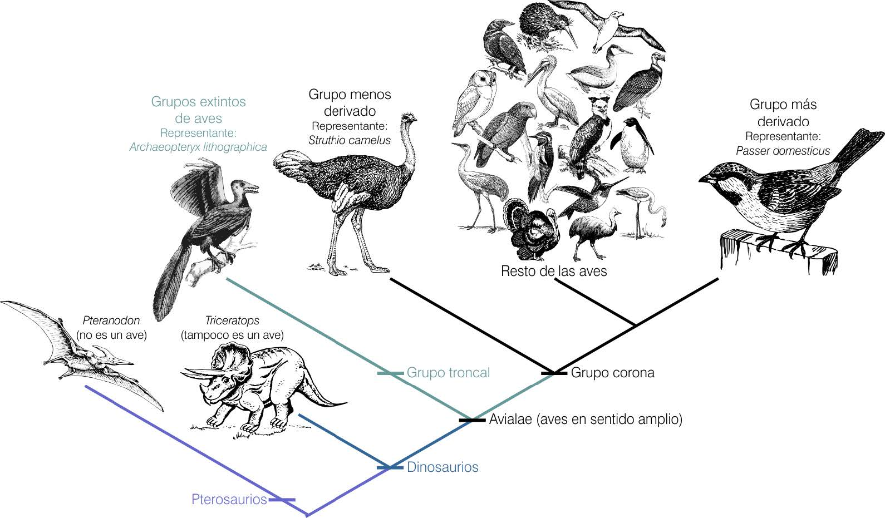
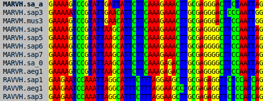
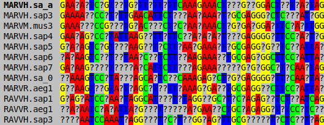
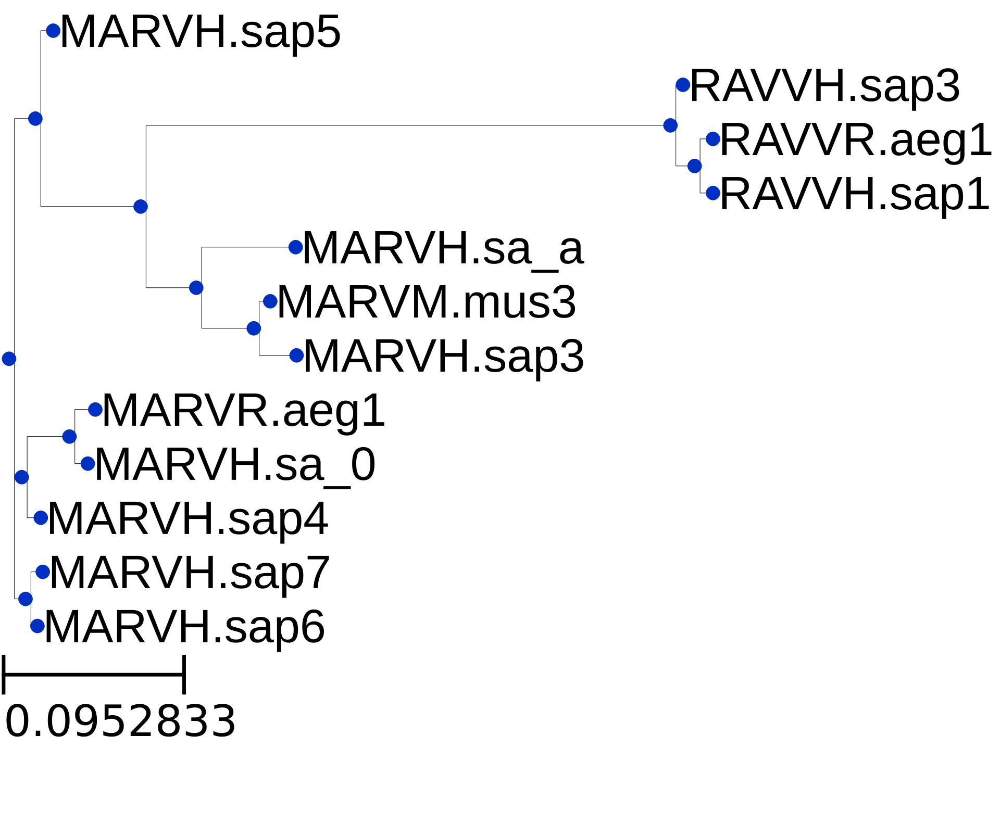
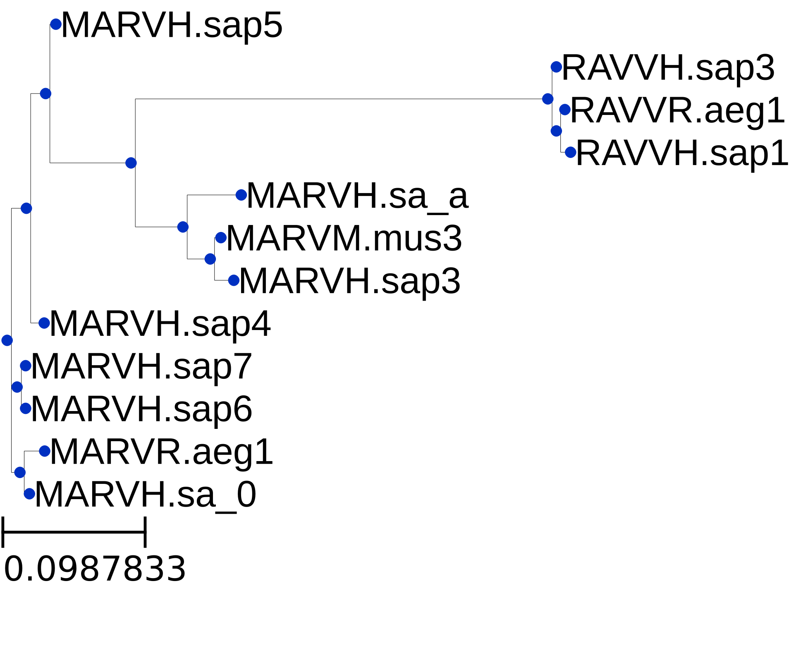
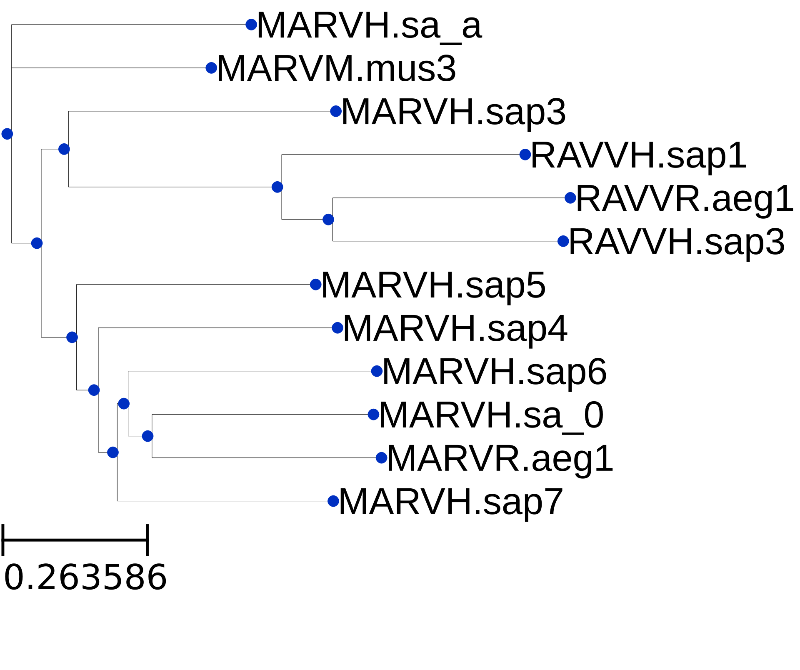

# TFG - Estudio de técnicas de Machine Learning para imputar datos perdidos en secuencias biológicas

## 🧩 El Problema

### ¿Por qué es importante la imputación de datos en filogenia?

    
    

        Los análisis computacionales en filogenia dependen de secuencias de ADN completas para reconstruir relaciones evolutivas entre organismos. Sin embargo, es frecuente que las matrices de datos contengan posiciones faltantes (<em>missing data</em>), lo que reduce la calidad de los árboles filogenéticos y afecta la robustez de las inferencias evolutivas.  
        <strong>Objetivo:</strong> Aplicar técnicas de Machine Learning para imputar o predecir los valores faltantes en las secuencias biológicas, mejorando así la integridad y calidad de los análisis filogenéticos.
    

    

        
        
Secuencia completa (sin datos perdidos)

    

    

        
        
Secuencia con 35% de datos perdidos

    

    
<b>ℹ️ Detalles sobre los conjuntos de datos utilizados</b>

    <ul>
        <li><b>M12x252</b>: 12 secuencias, 252 posiciones [1]</li>
        <li><b>M40x359</b>: 40 secuencias, 359 posiciones [2]</li>
        <li><b>M123x196</b>: 123 secuencias, 196 posiciones [3]</li>
        <li><b>M203x302</b>: 203 secuencias, 302 posiciones [4]</li>
    </ul>
    Todos los conjuntos incluyen versiones con diferentes porcentajes de datos perdidos para evaluar la robustez de los métodos de imputación.

---

# 🛠️ Enfoque y Métodos

**Tecnologías principales:**

    
    
    
    
    

Para abordar el problema de los datos ausentes, se han implementado y comparado diferentes técnicas de imputación y reconstrucción filogenética.

**Métodos evaluados:**

- **SimpleImputer**
- **LinearSVR**
- **BayesianRidge**
- **GaussianProcessRegressor**
- **KNeighborsRegressor**
- **KNNImputer**
- **DAMBE - MLCompositeTN93** (software filogenético, sin imputación)

---

## 📊 Resultados

### NRF Secuencial

| **Método**                                 | M12x252 | M40x359 | M123x196 | M203x302 | **Promedio** | **Pérdida** |
|--------------------------------------------|---------|---------|----------|----------|--------------|-------------|
| SimpleImputer (mean)                       | 0.3622  | 0.6378  | 0.9352   | 0.8461   | 0.6953       | 63.38%      |
| SimpleImputer (median)                     | 0.3289  | 0.6227  | 0.9060   | 0.8415   | 0.6748       | 58.55%      |
| SimpleImputer (most frequent)              | 0.3289  | 0.6195  | 0.9045   | 0.8397   | 0.6731       | 58.16%      |
| IterativeImputer (BayesianRidge)           | 0.1733  | 0.3405 | 0.6662   | 0.5769   | 0.4392       | 3.20%       |
| IterativeImputer (KNeighborsRegressor)     | 0.2133  | 0.4416  | 0.6445 | 0.4920   | 0.4479       | 5.23%       |
| IterativeImputer (LinearSVR)               | 0.1644 | 0.3665  | 0.6677   | 0.5038   | 0.4256   | 0.00%   |
| IterativeImputer (GaussianProcessRegressor)| 0.4778  | 0.7346  | 0.9345   | 0.9185   | 0.7663       | 80.06%      |
| KNNImputer                                 | 0.1911  | 0.4238  | 0.6607   | 0.4771 | 0.4382       | 2.95%       |
| DAMBE (MLCompositeTN93)                    | 0.4511  | 0.6914  | 0.9733   | 0.9353   | 0.7628       | 79.22%      |

### Tiempo de ejecución secuencial

| **Método**                                 | M12x252 | M40x359 | M123x196 | M203x302 | **Promedio** | **Pérdida** |
|--------------------------------------------|---------|---------|----------|----------|--------------|-------------|
| SimpleImputer (mean)                       | 0.0012  | 0.0014  | 0.0016   | 0.0022   | 0.0016       | -97.76%     |
| SimpleImputer (median)                     | 0.0014  | 0.0018  | 0.0022   | 0.0039   | 0.0023       | -96.70%     |
| SimpleImputer (most frequent)              | 0.0523  | 0.0697  | 0.0393   | 0.0600   | 0.0553       | -21.46%     |
| IterativeImputer (BayesianRidge)           | 4.1412  | 10.2118 | 7.4117   | 24.7196  | 11.6211      | 16398.48%   |
| IterativeImputer (KNeighborsRegressor)     | 0.5181  | 0.8759  | 0.5302   | 1.3882   | 0.8281       | 1075.65%    |
| IterativeImputer (LinearSVR)               | 8.1503  | 45.6914 | 54.5435  | 257.4513 | 91.4591      | 129744.99%  |
| IterativeImputer (GaussianProcessRegressor)| 0.5496  | 1.1204  | 2.4736   | 6.6919   | 2.7089       | 3745.80%    |
| KNNImputer                                 | 0.0409  | 0.0822  | 0.0566   | 0.1020   | 0.0704       | 0.00%       |

Valores en segundos. La columna "Pérdida" indica el incremento porcentual respecto al mejor método (KNNImputer).

<b>ℹ️ Detalles sobre la métrica Robinson-Foulds y resultados paralelos</b>

<b>Métrica Robinson-Foulds (NRF):</b> La calidad de los árboles filogenéticos estimados se evalúa mediante la distancia de Robinson-Foulds (RF), que mide la diferencia topológica entre dos árboles. Un valor más bajo indica mayor similitud entre el árbol estimado y el árbol de referencia. Para facilitar la comparación, los valores RF se han normalizado (NRF) dividiendo por el máximo posible para cada caso:

  
  

   
  
   
  
    <i>NRF (Normalized Robinson-Foulds)</i> 
    Valores más bajos indican mayor similitud entre el árbol estimado y el árbol de referencia: <b>NRF = 0</b> significa árboles idénticos, <b>NRF = 1</b> significa árboles completamente distintos.
  

<b>Nota sobre resultados paralelos:</b> Además de los resultados secuenciales mostrados, se han obtenido resultados en modo paralelo (multiprocessing) para evaluar la escalabilidad y eficiencia computacional de los métodos. Estos resultados no se incluyen aquí por motivos de espacio, pero están disponibles bajo petición o en los anexos del trabajo.

### Comparativa visual: importancia de una buena imputación

La siguiente figura muestra la diferencia entre el árbol filogenético original (verdad), el obtenido tras imputar con KNNImputer y el obtenido con DAMBE (sin imputación específica). Se observa cómo una imputación adecuada permite recuperar una topología mucho más cercana a la realidad biológica.

    
     Árbol original (realidad)

    
     Imputación KNNImputer sobre una muestra con 30% de pérdida. NRF:0.11

    
     DAMBE (sin imputación) sobre una muestra con 30% de pérdida. NRF:0.55

## Conclusión
El estudio demuestra que la imputación de datos perdidos en secuencias biológicas mediante técnicas de Machine Learning puede mejorar significativamente la calidad de los árboles filogenéticos resultantes. Métodos como KNNImputer y IterativeImputer con BayesianRidge ofrecen un equilibrio favorable entre precisión y tiempo de ejecución, superando a enfoques tradicionales como DAMBE que no aplican imputación específica. Estos hallazgos resaltan la importancia de abordar los datos faltantes en análisis filogenéticos para obtener inferencias evolutivas más robustas y fiables.

---

## 📄 Documentación

Puedes consultar el documento oficial del TFG en el siguiente enlace:  
[Descargar TFG (PDF)](https://drive.google.com/file/d/1bYnwP0hjTU9AiCWYofYuEF44Rzn2_Mo0/view?usp=drive_link)

---

## 📚 Referencias

<ul style="font-size:1.05em; line-height:1.7; text-align:left; max-width:900px;">
	<li>[1] C. Kuiken, J. Thurmond, M. Dimitrijevic, and H. Yoon. The LANL hemorrhagic fever virus database, a new platform for analyzing biothreat viruses. <i>Nucleic Acids Research</i>, 40:D587–D592, 2012.</li>
	<li>[2] L. Quijada, H.-O. Baral, R. Jaen-Molina, M. Weiss, J. C. Pé-Castells, and E. Beltrán-Tejera. Phylogenetic and morphological circumscription of the Orbilia aurantiorubra group. <i>Phytotaxa</i>, 175(1):1–18, 2014.</li>
	<li>[3] J. Zhang, M. Chen, X. Dong, R. Lin, J. Fan, and Z. Chen. Evaluation of four commonly used DNA barcoding loci for Chinese medicinal plants of the family Schisandraceae. <i>PLoS One</i>, 10(5):e0125574, 2015.</li>
	<li>[4] C. Salgado-Salazar, A. Y. Rossman, and P. Chaverri. The genus Thelonectria (Nectriaceae, Hypocreales, Ascomycota) and closely related species with cylindrocarpon-like asexual states. <i>Fungal Diversity</i>, 80:411–455, 2016.</li>
</ul>